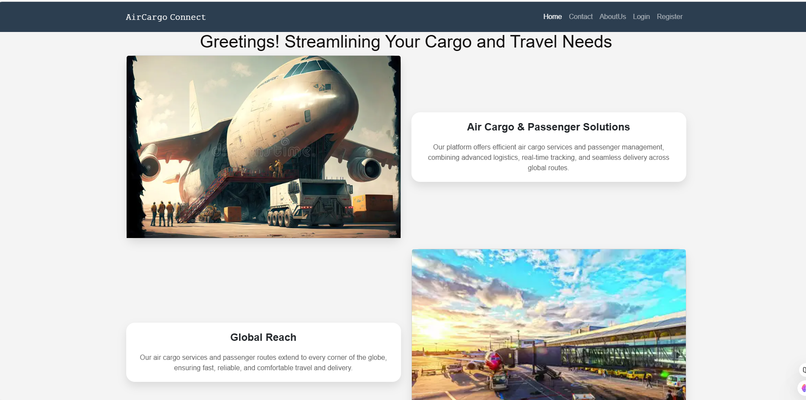
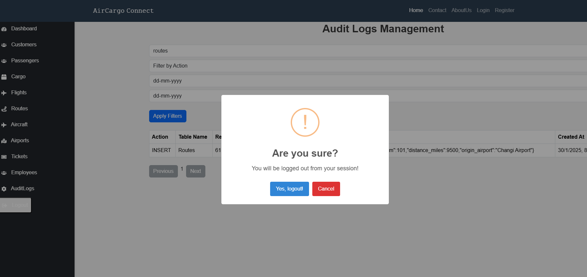
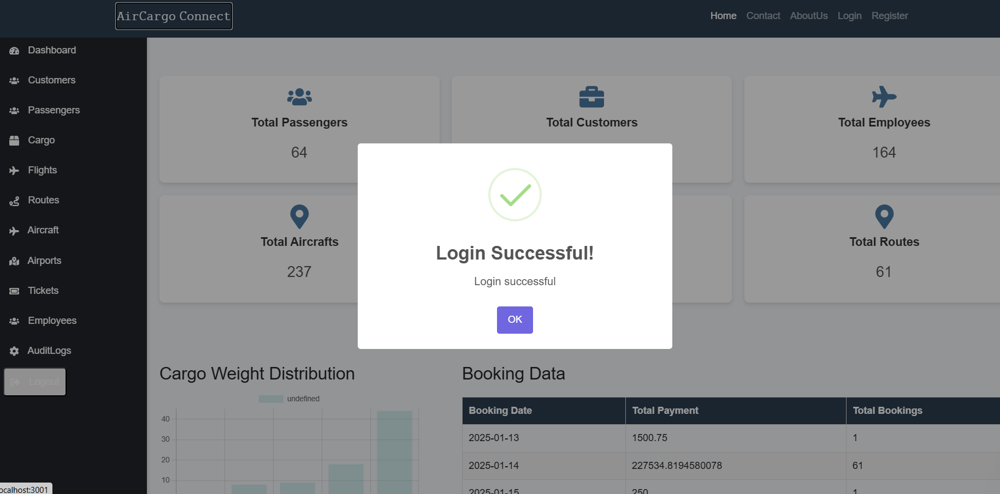
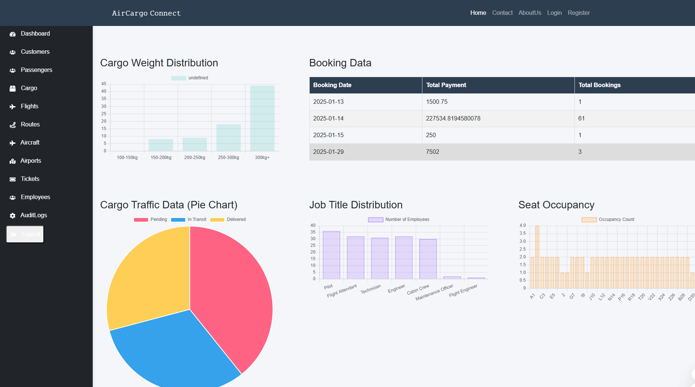
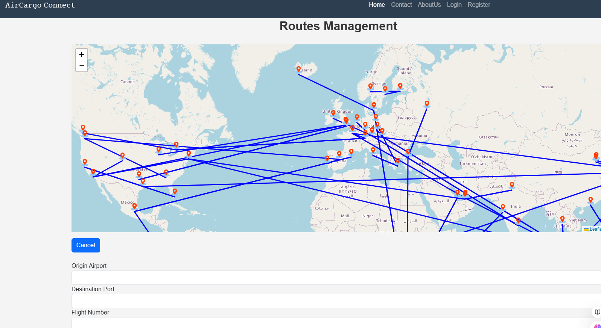
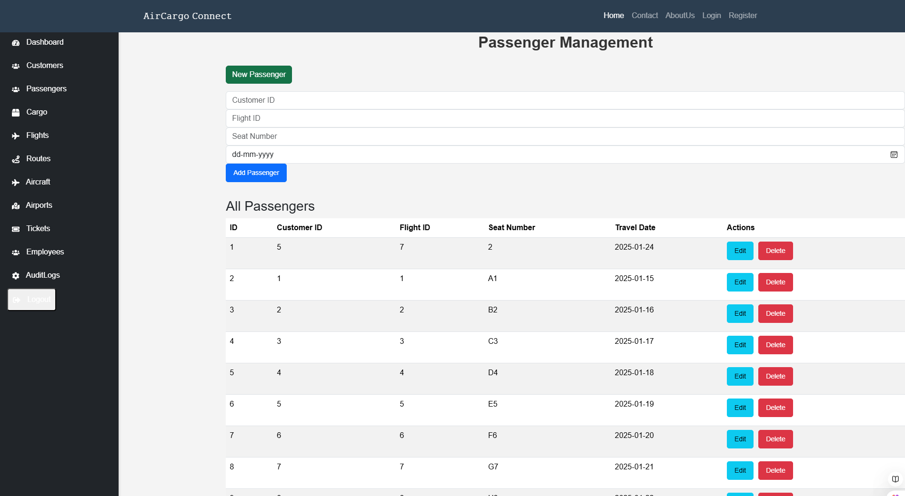

# ✈️ AirCargo Analysis

A **secure, scalable, and interactive** web-based dashboard for managing aviation operations, built as part of the Database Management Systems Laboratory Mini Project at **Global Academy of Technology**.  
The system streamlines **cargo booking, tracking, route management, and analytics**, with features like **real-time data visualization, role-based authentication, and audit logging**.

---

## 📌 Features

- **Secure Authentication & RBAC**  
  - JWT-based login/logout  
  - Role-based access control for admins, employees, and customers  
  - Audit logging for transparency  

- **Air Cargo Management**  
  - Customer, cargo, aircraft, employee, and route management  
  - Real-time cargo and flight tracking  
  - Booking and ticket management  

- **Interactive Data Visualization**  
  - Charts and tables for cargo traffic, seat occupancy, and route utilization  
  - Geo-mapping for route visualization  

- **Database-Driven Backend**  
  - MySQL/PostgreSQL with Sequelize ORM  
  - Triggers and stored procedures for automation  
  - Optimized queries for performance  

- **Responsive Frontend**  
  - Built with React.js, Bootstrap, and CSS  
  - API integration via Axios  
  - User-friendly dashboard interface  

---

## 🛠 Tech Stack

**Frontend:**  
- React.js  
- Bootstrap & CSS  
- Axios (API integration)  

**Backend:**  
- Node.js  
- Express.js  
- Sequelize ORM  

**Database:**  
- MySQL Workbench 

**Security:**  
- JWT Authentication  
- bcrypt.js (password hashing)  

**Development Tools:**  
- VS Code  
- Postman / Thunder Client  
- Git & GitHub  

---

## 📂 Project Structure

\`\`\`
AirCargo-Analysis/
│
├── backend/           # Node.js + Express API
│   ├── models/        # Sequelize models
│   ├── routes/        # API routes
│   ├── controllers/   # Business logic
│   └── config/        # DB connection & environment config
│
├── frontend/          # React.js frontend
│   ├── components/    # Reusable UI components
│   ├── pages/         # Dashboard & management screens
│   └── services/      # API calls
│
└── README.md
\`\`\`

---

## 🚀 Installation & Setup

### 1️⃣ Clone the Repository
\`\`\`bash
git clone https://github.com/Starplayevryr/AirCargo-Analysis.git
cd AirCargo-Analysis
\`\`\`

### 2️⃣ Backend Setup
\`\`\`bash
cd backend
npm install
\`\`\`
- Create a \`.env\` file with:
\`\`\`
DB_HOST=localhost
DB_USER=your_username
DB_PASS=your_password
DB_NAME=aircargo
JWT_SECRET=your_secret
\`\`\`
- Run backend:
\`\`\`bash
npm start
\`\`\`

### 3️⃣ Frontend Setup
\`\`\`bash
cd frontend
npm install
npm start
\`\`\`

---

## 📊 Testing
- **API Testing:** Thunder Client/Postman for CRUD operations  
- **Authentication Testing:** JWT token validation and protected route checks  
- **Database Testing:** Validations for constraints, integrity, and triggers  

---

## 📷 Screenshots
- Dashboard Home Page  
- Data Management Screens  
- Route Visualization with Geomapping  
- API Testing in Thunder Client  

---

## 🔮 Future Scope
- AI/ML for demand forecasting and route optimization  
- Cloud deployment (AWS/Azure/GCP)  
- Mobile app version with push notifications  
- Multi-factor authentication and enhanced encryption  

---

## 👨‍💻 Authors
- **Keerthana R** (1GA22CS083)  
- **Jnanashree R** (1GA22CS079)  

Under the guidance of:  
- Prof. Reshma D’Souza  
- Prof. Nayana Rani S  

---

## 📜 License
This project is for educational purposes and part of **VTU BE CSE 5th Semester Mini Project**.
